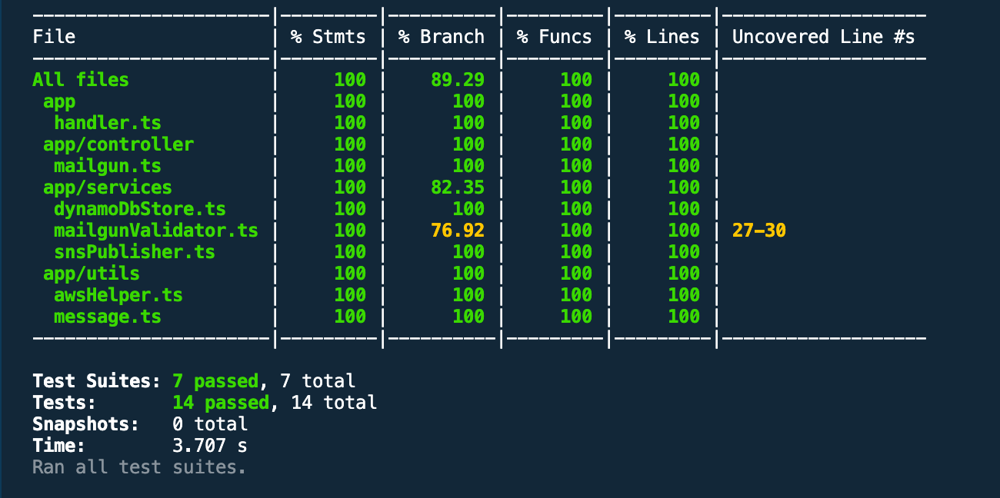

# Serverless Nodejs Rest API with TypeScript for mailgun hooks

This is simple REST API web hook for mail gun to publish its event received to SNS topic, also
saves the raw event in dynamodb.

## Use Cases

- REST API with typescript
- MongoDB Atlas data storage
- Multi-environment management under Serverless
- jest unit test with aws-sdk-mock for mocking AWS.
- AWS lambda function log view

## Resources it will create?

- Dynamodb table to store mailgun raw data
- SNS notification topic
- SSM paramters
- lambda function
- Api gateway

## How to run?

- npm install -g serverless
- npm install
- serverless deploy -s <stage>

## Run unit test?

- npm run test

### Output

